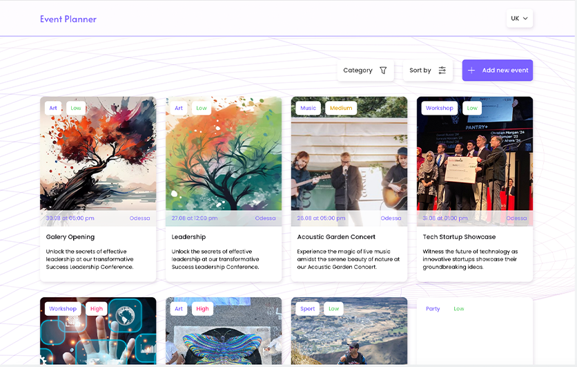

<h1 align="center">Event planner</h1>

Application for planning events. You can create an event and enter all the data about it. Also implemented filter events by several criteria and the ability to edit the event.The application is also adapted for mobile devices.

<h2>Description of the application</h2>
<ul>
<li>The application has pages: Home, Create, Details, Edit</li>
<li>The Homr page contains events cards</li>
<li>The Create page has a form for creating a new event</li>
<li>The Details page displays a description of the selected event</li>
<li>The Edit page allows you to edit the selected event</li>
<li>The application has the ability to filter event cards by category</li>
<li>Sorting of events is also available: by name, by priority and by event date</li>
<li>The Tweets page has a Back button that takes you to the main page</li>
<li>If the user entered using a non-existent route, he is redirected to the home page</li>
</ul>

<h2>Used technology</h2>
<ul>
<li>JavaScript</li>
<li>React</li>
<li>React Router Dom</li>
<li>CSS Modules</li>
</ul>
